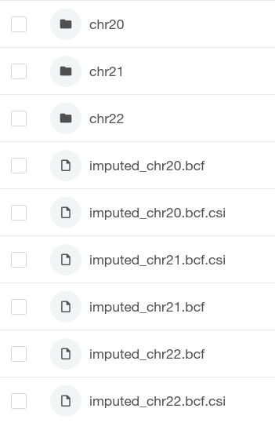

# Running the low-coverage pipeline

### Uploading low-coverage data (BAM/CRAMs)

As a user of the low-coverage pipeline, you are expected to upload your low-coverage BAM/CRAM files (one file per sample per chromosome). Your files can be located anywhere on the RAP, but by convention, you should use the following folder:

<pre class="language-bash"><code class="lang-bash"><strong>ukb-imputation/glimpse2/tar_bam_files/ #location of the uploaded BAM/CRAMs
</strong></code></pre>

The names used and the structure of this directory are arbitrary and the user can decide how to better organise it.

To perform imputation the pipeline expects a list (a .txt file, one file per line). The list is expected to be located in the folder:

<pre class="language-bash"><code class="lang-bash"><strong>ukb-imputation/glimpse2/tar_bam_list #location of a list of BAM/CRAMs
</strong></code></pre>

You will need a list per chromosome (per batch). Each file location should be prefixed by "/mnt/project/\[RAP location]" and will look similarly to this:

```
/mnt/project/ukb-imputation/glimpse2/tar_bam_files/batch_00001/chr5/455484275.bam
/mnt/project/ukb-imputation/glimpse2/tar_bam_files/batch_00001/chr5/3424998282.bam
/mnt/project/ukb-imputation/glimpse2/tar_bam_files/batch_00001/chr5/189508732.bam
...
```

Where the prefix of the filename is treated as the sample ID. To have a custom ID per sample, add an additional column with the desired name:

```
/mnt/project/ukb-imputation/glimpse2/tar_bam_files/batch_00001/chr5/455484275.bam sample1
/mnt/project/ukb-imputation/glimpse2/tar_bam_files/batch_00001/chr5/3424998282.bam sample2
/mnt/project/ukb-imputation/glimpse2/tar_bam_files/batch_00001/chr5/189508732.bam sample3
...
```

A list contains the sample of a single batch. You can tell the pipeline what list to use using the `tar_pfx` and `tar_sfx` parameters (see below).

### First-time usage - Create the binary reference panel representation

Running the pipeline with default parameters, and performing conversion of the reference panel file format can be done as follows:

<pre class="language-bash"><code class="lang-bash"><strong>#get current project ID
</strong>PROJ=$(dx env | grep "Current workspace" | head -n 1 | awk -F'\t' '{print $2}')

<strong>for CHR in 20; do #use {1..22} for all autosomes
</strong>    dx run /ukb-imputation/apps/low-coverage-pipeline \
        --name "low-coverage-pipeline-chr${CHR}-b00001"  \
        -i "project=${PROJ}" \
        -i "chr=${CHR}" \
        -i "run_convert_reference_module=true" \
        -i "run_impute_module=false" \
        -i "mount_inputs=true" \
        -y \
        --brief
done
</code></pre>

You can specify `-i "run_impute_module=true"` to perform reference panel conversion and the imputation step subsequently. However, we do not recommend doing so. As the conversion step works with inefficient VCF files, the conversion can take several hours to complete. We therefore recommend splitting the creation of the reference panel from the imputation step.

Please note that we use the option `-i "mount_inputs=true"` in the command above. The reason is that the provided phased VCF files are very large and we want to access only a region within a chromosome. Therefore, downloading the whole file would be wasteful. The option `-i "run_impute_module=true"` allows us to use the `dxfuse`program to stream the file as it was local, therefore efficiently accessing only the region of interest. However, in the rest of the pipeline, we assume the default `-i "mount_inputs=false"` as we handle much smaller files and downloading is usually more efficient.

### Subsequent usages - Run the imputation

For subsequent usages, the creation of the binary reference panel can be skipped as the reference panel is stored in your project directory. You can therefore run:

```bash
#get current project ID
PROJ=$(dx env | grep "Current workspace" | head -n 1 | awk -F'\t' '{print $2}')

for CHR in 20; do #use {1..22} for all autosomes
    dx run /ukb-imputation/apps/low-coverage-pipeline \
        --name "low-coverage-pipeline-chr${CHR}-b00002"  \
        -i "project=${PROJ}" \
        -i "chr=${CHR}" \
        -i "run_convert_reference_module=false" \ #<---
        -i "run_impute_module=true" \
        -i "batch_id=batch_00002" \
        -i "tar_pfx=list_batch_00002_c" \
        -i "tar_sfx=.txt" \
        -y \
        --brief
done
```

Please note we deactivated the covert reference module.

### Changing default parameters

The pipeline has several default parameters that can be changed. To obtain the full list of options, you can run:

```bash
dx describe /apps/low-coverage-pipeline
```

The parameters are summarised below:

<table><thead><tr><th width="168.33333333333331">Option name</th><th width="258">Default</th><th>Description</th></tr></thead><tbody><tr><td>project</td><td>-</td><td><strong>String</strong>. Project ID.</td></tr><tr><td>run_convert_reference_module</td><td>false</td><td><strong>Boolean</strong>. Whether to convert the reference panel. Must be specified to true the first time the pipeline is run.</td></tr><tr><td>run_impute_module</td><td>true</td><td><strong>Boolean</strong>. Whether to run the imputation module.</td></tr><tr><td>app_pth</td><td>apps/</td><td><strong>String</strong>. Location of the apples.</td></tr><tr><td>ref_bcf_pth</td><td>Bulk/Whole\ genome\ sequences/SHAPEIT\ Phased\ VCFs/</td><td><strong>String</strong>. Location of the reference panel vcf/bcf files.</td></tr><tr><td>ref_bin_pth</td><td>ukb-imputation/glimpse2/ref_bin_phased/</td><td><strong>String</strong>. Location of the binary reference panel.</td></tr><tr><td>tar_bams_pth</td><td>ukb-imputation/glimpse2/tar_bam_list/</td><td><strong>String</strong>. Location of the list containing the path of each low-coverage BAM file.</td></tr><tr><td>fasta_ref</td><td>ukb-imputation/glimpse2/ref_genome/GRCh38_full_analysis_set_plus_decoy_hla.fa</td><td><strong>String</strong>. Location of the fasta reference genome.</td></tr><tr><td>fasta_idx</td><td>ukb-imputation/glimpse2/ref_genome/GRCh38_full_analysis_set_plus_decoy_hla.fa.fai</td><td><strong>String</strong>. Location of the fasta (faidx) index.</td></tr><tr><td>map_pth</td><td>ukb-imputation/glimpse2/maps/</td><td><strong>String</strong>. Location of the genetic maps.</td></tr><tr><td>cnk_pth</td><td>ukb-imputation/glimpse2/chunks/</td><td><strong>String</strong>. Location of the chunks file.</td></tr><tr><td>out_pth</td><td>ukb-imputation/glimpse2/out/</td><td><strong>String</strong>. Location of the output directory.</td></tr><tr><td>ref_pfx</td><td>ukb20279_c</td><td><strong>String</strong>. Prefix name of the reference panel file (followed by chromosome).</td></tr><tr><td>ref_sfx</td><td>_b0_v1.vcf.gz</td><td><strong>String</strong>. Suffix name of the reference panel file (preceded by chromosome).</td></tr><tr><td>tar_pfx</td><td>list_batch_00000_c</td><td><strong>String</strong>. Prefix name of the target panel file (followed by chromosome).</td></tr><tr><td>tar_sfx</td><td>.txt</td><td><strong>String</strong>. Suffix name of the target panel file (preceded by chromosome).</td></tr><tr><td>batch_id</td><td>batch_00000</td><td><strong>String</strong>. Batch ID. Please change this for each batch.</td></tr><tr><td><strong>chr</strong></td><td>-</td><td><strong>String</strong>. Chromosome ID. Please use only the number (no "chr" prefix).</td></tr><tr><td>imp_arg</td><td>-</td><td><strong>String</strong>. Additional imputation arguments.</td></tr><tr><td>mount_inputs</td><td>false</td><td><strong>Boolean</strong>. Whether to use dxfuse to mount inputs instead of downloading.</td></tr><tr><td>conversion_instance_type</td><td>mem2_ssd1_v2_x4</td><td><strong>String</strong>. Machine to use for the conversion module.</td></tr><tr><td>imputation_instance_type</td><td>mem2_ssd1_v2_x4</td><td><strong>String</strong>. Machine to use for the imputation module.</td></tr></tbody></table>

Each of these parameters can be changed. To specify a different value for one of these parameters, for example changing the batch id to `batch_99999`, would require to:

```bash
#get current project ID
PROJ=$(dx env | grep "Current workspace" | head -n 1 | awk -F'\t' '{print $2}')

for CHR in 20; do #use {1..22} for all autosomes
    dx run /ukb-imputation/apps/low-coverage-pipeline \
        --name "low-coverage-pipeline-chr${CHR}-b99999"  \ #<--- optional
        -i "project=${PROJ}" \
        -i "chr=${CHR}" \
        -i "run_convert_reference_module=false" \
        -i "run_impute_module=true" \
        -i "batch_id=batch_99999" \ #<---
        -i "tar_pfx=list_batch_99999_c" \
        -i "tar_sfx=.txt" \
        -y \
        --brief
done
```

### Output and temporary files

By default, the pipeline keeps the intermediate (chunk-level) imputed files and also provides a chromosome-level file per chromosome. For example, after imputing data for chromosomes 20-22 for a batch of samples (batch\_00000), the pipeline will by default create a subfolder named `batch_00000` in the directory `data/glimpse2/out/`. The content of this folder will look like this:



Where the BCF files called "imputed\_chr\*.bcf\[.csi]" are chromosome-level ligated BCF files of the imputed samples of `batch_00000`. The folders named `chr20`, `chr21` and `chr22` contain chunk-level imputed chunks, together with log files and performance files (output of `/bin/time -v`). As these files can be quite large and influence the cost of long-term storage costs, we recommend deleting these temporary folders once verified that the imputation runs successfully.
