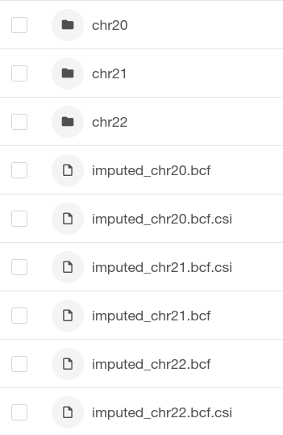

# Running the SNP array pipeline

### Uploading SNP array data data (VCF/BCF)

As a user of the SNP array pipeline you are expected to upload your SNP array files. Your files can be located anywhere on the RAP and can be phased or unphased. By convention, your unphased SNP array data should go in the following folder:

<pre class="language-bash"><code class="lang-bash"><strong>ukb-imputation/impute5/tar_bcf_files/ #location of the target panel in VCF/BCF format
</strong></code></pre>

The names used and the structure of this directory is arbitrary and the user can decide how to better organise it. You will need a VCF/BCF file per chromosome (per batch). You can tell the pipeline what VCF/BCF file to use using the `tar_pfx` and `tar_sfx` parameters (see below).

### First time usage - Create the binary reference panel representation

Running the pipeline with default parameters, performing conversion of the reference panel file format and prephasing can be done as follows:

<pre class="language-bash"><code class="lang-bash"><strong>#get current project id
</strong>PROJ=$(dx env | grep "Current workspace" | head -n 1 | awk -F'\t' '{print $2}')

<strong>for CHR in 20; do #use {1..22} for all autosomes
</strong>    dx run /apps/snp-array-pipeline \
        --name "snp-array-pipeline-chr${CHR}-conversion-only"  \
        -i "project=${PROJ}" \
        -i "chr=${CHR}" \
        -i "run_convert_reference_module=true" \
        -i "run_phase_module=false" \
        -i "run_convert_target_module=false" \
        -i "run_impute_module=false" \
        -i "mount_inputs=true" \
        -y \
        --brief
done
</code></pre>

You can specify `-i "run_phase_module=true"` and `-i "run_impute_module=true"` to perform reference panel conversion and the prephasing and imputation step subsequently. However we do not recommend doing so. As the conversion step works with ineffecient VCF files, the conversion can take several hours to complete. We therefore recommend splitting the creation of the reference panel from the imputation step.

Please note that we use the option `-i "mount_inputs=true"` in the command above. The reason is that the provided phased VCF files are very large and we want to access only a region within a chromosome. Therefore, downloading the whole file would be wasteful. The option `-i "run_impute_module=true"` allows is to use the `dxfuse`program to stream the file as it was local, therefore efficiently accessing only the region of interest. However, in the rest of the pipeline we assume the default `-i "mount_inputs=false"` as we handle much smaller files and donwloading is usually more efficient.

### Subsequent usages - Run imputation

For subsequent usages, the creation of the binary reference panel can be skipped as the reference panel is stored in your project directory. You can therefore run:

```bash
#get current project id
PROJ=$(dx env | grep "Current workspace" | head -n 1 | awk -F'\t' '{print $2}')

for CHR in 20; do #use {1..22} for all autosomes
    dx run /apps/snp-array-pipeline \
        --name "snp-array-pipeline-chr${CHR}-b00001"  \
        -i "project=${PROJ}" \
        -i "chr=${CHR}" \
        -i "run_convert_reference_module=false" \
        -i "run_phase_module=true" \ #<-- prephasing is performed
        -i "run_convert_target_module=false" \ #<-- no conversion if pre-phasing is performed
        -i "run_impute_module=true" \ #<-- imputation is performed
        -i "batch_id=batch_00001" \
        -y \
        --brief
done
```

Please note we deactivated the covert reference module. Here we just run pre-phasing and then imputation. As `-i "run_convert_reference_module=false"` is the default, it could be omitted (and the same is true for the convert target module).

### Changing default parameters

The pipeline has several default parameters that can be changed. To obtain the full list of options, you can run:

```bash
dx describe /apps/snp-array-pipeline
```

The parameters are summarised below:

<table><thead><tr><th width="168.33333333333331">Option name</th><th width="213">Default</th><th>Description</th></tr></thead><tbody><tr><td>project</td><td>-</td><td><strong>String</strong>. Project ID.</td></tr><tr><td>run_convert_reference_module</td><td>false</td><td><strong>Boolean</strong>. Whether to convert the reference panel. Must be specified to true the first time the pipeline is run.</td></tr><tr><td>run_phase_module</td><td>false</td><td><strong>Boolean</strong>. Whether to run prephasing on the target panel (conversion to xcf file format is automatically performed by SHAPEIT).</td></tr><tr><td>run_convert_target_module</td><td>false</td><td><strong>Boolean</strong>. Whether to convert the target panel. Must be specified to true if no prephasing is run (e.g. already phased data).</td></tr><tr><td>run_impute_module</td><td>true</td><td><strong>Boolean</strong>. Whether to run the imputation module.</td></tr><tr><td>app_pth</td><td>apps/</td><td><strong>String</strong>. Location of the apples.</td></tr><tr><td>ref_bcf_pth</td><td>Bulk/Whole\ genome\ sequences/SHAPEIT\ Phased\ VCFs/</td><td><strong>String</strong>. Location of the reference panel vcf/bcf files.</td></tr><tr><td>ref_xcf_pth</td><td>data/impute5/ref_xcf_phased/</td><td><strong>String</strong>. Location of the binary reference panel.</td></tr><tr><td>tar_bcf_pth</td><td>data/impute5/tar_bcf_files/</td><td><strong>String</strong>. Location of the target BCF files containing the SNP array data (one per chromosome).</td></tr><tr><td>map_pth</td><td>data/impute5/maps/</td><td><strong>String</strong>. Location of the genetic maps.</td></tr><tr><td>cnk_pth</td><td>data/impute5/chunks/</td><td><strong>String</strong>. Location of the chunks file.</td></tr><tr><td>out_pth</td><td>data/impute5/out/</td><td><strong>String</strong>. Location of the output directory.</td></tr><tr><td>ref_pfx</td><td>ukb20279_c</td><td><strong>String</strong>. Prefix name of the reference panel file (followed by chromosome).</td></tr><tr><td>ref_sfx</td><td>_b0_v1.vcf.gz</td><td><strong>String</strong>. Suffix name of the reference panel file (precended by chromosome).</td></tr><tr><td>tar_pfx</td><td>snp_array_c</td><td><strong>String</strong>. Prefix name of the target panel file (followed by chromosome).</td></tr><tr><td>tar_sfx</td><td>_b38_unphased.bcf</td><td><strong>String</strong>. Suffix name of the target panel file (precended by chromosome)</td></tr><tr><td>batch_id</td><td>batch_00000</td><td><strong>String</strong>. Batch ID. Please change this for each batch.</td></tr><tr><td><strong>chr</strong></td><td>-</td><td><strong>String</strong>. Chromosome ID. Please use only the number (no "chr" prefix).</td></tr><tr><td>phs_arg</td><td>-</td><td><strong>String</strong>. Additional phasing arguments.</td></tr><tr><td>imp_arg</td><td>-</td><td><strong>String</strong>. Additional imputation arguments.</td></tr><tr><td>mount_inputs</td><td>false</td><td><strong>Boolean</strong>. Whether to use dxfuse to mount inputs instead of downloading.</td></tr><tr><td>conversion_instance_type</td><td>mem2_ssd1_v2_x4</td><td><strong>String</strong>. Machine to use for the conversion module.</td></tr><tr><td>phasing_instance_type</td><td>mem2_ssd1_v2_x4</td><td><strong>String</strong>. Machine to use for the pre-phasing module.</td></tr><tr><td>imputation_instance_type</td><td>mem2_ssd1_v2_x4</td><td><strong>String</strong>. Machine to use for the imputation module.</td></tr></tbody></table>

Each of these parameters can be changed. To specify a different value for one of these parameters, for example changing the batch id to `batch_99999`, would require to:

```bash
#get current project id
PROJ=$(dx env | grep "Current workspace" | head -n 1 | awk -F'\t' '{print $2}')

for CHR in 20; do #use {1..22} for all autosomes
    dx run /apps/snp-array-pipeline \
        --name "snp-array-pipeline-chr${CHR}_b99999"  \ #<---
        -i "project=${PROJ}" \
        -i "chr=${CHR}" \
        -i "run_phase_module=true" \
        -i "run_impute_module=true" \
        -i "batch_id=batch_99999" \ #<---
        -y \
        --brief
done
```

### Output and temporary files

By default the pipeline keeps the intermediate (chunk-level) imputed files, and also provides a chromosome-level file per chromsome. For example, after imputing data for chromosomes 20-22 for batch of samples (batch\_00000), the pipeline will by default create a subfolder named `batch_00000` in the directory `data/impute5/out/`. The content of this folder will look like this:



Where the bcf files called "imputed\_chr\*.bcf\[.csi]" are chromosome-level ligated bcf files of the imputed samples of `batch_00000`. The folders named `chr20`, `chr21` and `chr22` contain chunk-level imputed chunks, together with log files and performance files (output of `/bin/time -v`). As these files can be quite large and infulecne the cost of the long-term storage costs, we recommend deleting these temporary folders once verified that the imputation run successfully.
