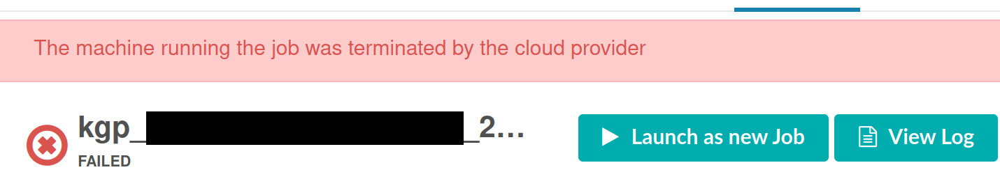

# Troubleshooting

## Failed jobs

When running jobs on the RAP, it's not uncommon for job failures to occur, typically due to the handling of job priorities (spot vs. on-demand instances) and resource allocation issues. To ensure a smooth workflow, it's crucial to understand [how priority is managed within the RAP](https://dnanexus.gitbook.io/uk-biobank-rap/working-on-the-research-analysis-platform/managing-job-priority) and to stay informed about the latest UK Biobank RAP rate card, which outlines the associated costs.

In the event of a job failure, it's essential to investigate the root cause. You can do this through the graphical user interface or by utilizing the following command:

```bash
dx describe <job-id>
```

Look specifically for the "Failure reason" and "Failure message" lines to pinpoint the exact issue. To identify the ID of a failed job, you can use the command:

```bash
dx find jobs --state failed
```

For more detailed information on using `dx describe` and `dx find jobs`, please refer to the [DNAnexus documentation](https://documentation.dnanexus.com/user/helpstrings-of-sdk-command-line-utilities). This proactive approach to diagnosing and addressing job failures is key to maintaining a successful workflow on the RAP.

In the following, we highlight some of the most common reasons of&#x20;

### Re-running jobs due to stochastic failure

For price reasons, we set "low" as a default priority in every computational job of the pipelines. Therefore, you can encounter stochastic failures during job execution due to a spot instance terminated by the scheduler to reserve it to another resource with higher priority.&#x20;

The error reported by the RAP is "<mark style="color:red;">SpotInstanceInterruption</mark>" and its associated message is "<mark style="color:red;">The machine running the job was terminated by the cloud provider</mark>". Empirically, we see this happening for jobs running for a few hours on the smallest instances or shorter times for jobs running on larger instances.



The DNAnexus platform offers a handy parameter in the `dx run` command, named `--clone`, explicitly designed to address this issue. To utilize this feature, you'll need to provide the ID of the failed job as its value.

To incorporate this functionality with the `dx find job` command, follow this one-liner:

```bash
dx find jobs --state failed --created-after 2023-09-20 -n 10 --brief | xargs -I {} dx run --clone {} -y --brief
```

This command re-runs the last 10 failed jobs created after a specific date while maintaining the same parameters as the original jobs (including their priority, name, and input/outputs). Notably, the RAP detects that you're re-running the job and appends a " (re-run)" suffix to the job name for clarity.&#x20;

In the context of our pipelines, please re-run only computational jobs (conversion, imputation, pre-phasing) and not pipeline jobs. If the job failed for another reason (e.g. the allocated resources were not sufficient, please look at the following section.

### Re-running failed jobs due to insufficiently allocated resources

Another common case is dealing with instances where jobs fail due to insufficient resources. Similar to re-running jobs due to stochastic failure, we can build upon the `--clone` option. In this case, you can not only clone the failed job but also specify a larger instance type and overwrite other parameters, such as the job name or priority, if necessary.

To execute this, you can adapt the `dx run` command as follows:

```bash
dx run --clone <failed_job_ID> -y --instance-type <larger_instance_type> --priority <new_priority> --name <new_job_name>
```

By using the `--clone` option in combination with instance type, priority, and name modifications, you gain the flexibility to rerun jobs with enhanced resource allocation. This approach ensures that your jobs have the necessary resources to complete their tasks, mitigating issues caused by resource constraints.

### Re-running failed jobs due to another problem

If other problems can arise, they can be both stochastic or software-related. Please re-run your job using the --clone option, and if the same message/error is shown, open an issue on [GitHub](https://github.com/srubinacci/imputation-ukb-ref-panel).
